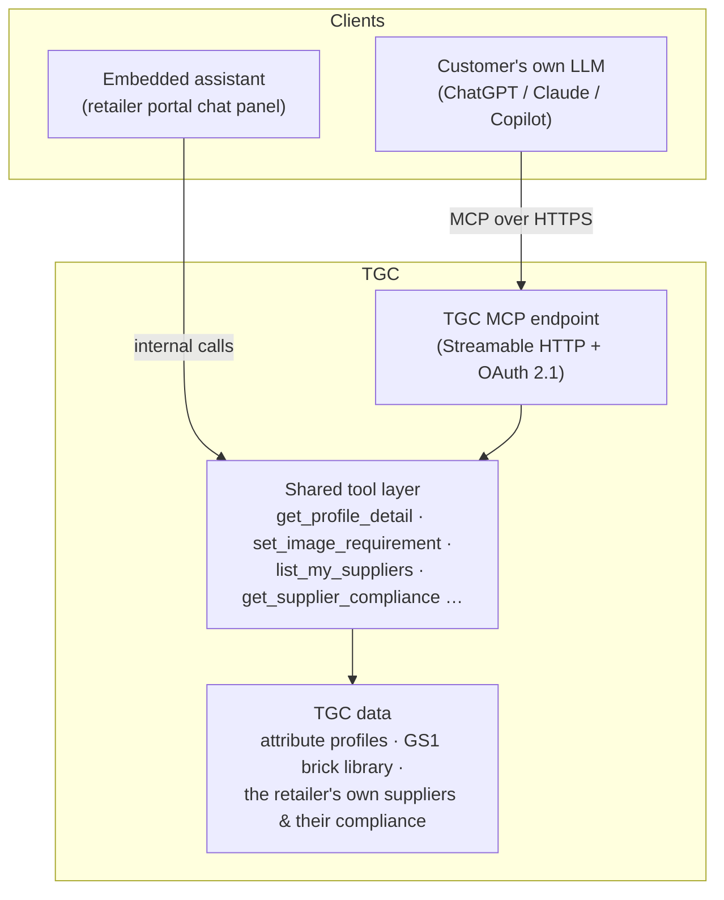

# MCP for Trading Grid Catalogue — Concept Brief

**Status:** Concept / brainstorm — not committed roadmap
**Scope:** Retailer (hub) persona first; supplier (spoke) persona phased in later
**Grounding:** All entities, screens, and example data referenced here exist in this prototype today

---

## 1. MCP in 60 seconds

MCP (Model Context Protocol) is an open standard — created by Anthropic, now adopted by ChatGPT/OpenAI, Google, Microsoft Copilot, and most major LLM clients — that lets an AI assistant connect to an external system through a uniform interface. A system exposes an **MCP server** with three primitives:

| Primitive | What it is | TGC example |
|---|---|---|
| **Tools** | Actions the LLM can call with structured arguments | `create_vendor_exception(vendor, profile, type, attributes, valid_until)` |
| **Resources** | Readable data the LLM can pull into context | `tgc://profiles/10001333` — the full Dresses attribute profile |
| **Prompts** | Pre-packaged workflows the user can invoke | "Set up requirements for a new category" |

Any MCP-capable client — Claude, ChatGPT, Copilot, or a chatbot embedded in our own UI — can discover and use these capabilities, with the user's authorization. That's the key economic point: **we build the integration once, and every LLM on the market becomes a front end for TGC.** A bespoke chatbot API would give us one surface; an MCP server gives us all of them, including ones that don't exist yet.

---

## 2. Two plays, one tool layer

The idea splits into two distinct products that share a single backend investment.

### Play A — Embedded assistant (inbound)

A chat panel inside the retailer portal. A category manager types:

> "Require two lifestyle images at least 2000px on a white background for all Dresses."

The assistant resolves "Dresses" to GS1 brick `10001333`, opens the profile, and stages an image-requirement change for confirmation. MCP here is internal plumbing — the user never hears the word "protocol." The win is **conversational requirement authoring**: today this takes navigating Attribute Profiles → Profile Detail → Add Image Requirement and filling six fields (format, background, min dimensions, max file size, shape/crop).

### Play B — Exposed MCP server (outbound)

TGC publishes an authenticated MCP endpoint. Customers connect it to *their own* AI — the ChatGPT or Claude workspace they already live in:

- A retailer asks their assistant: *"Which of my vendors are furthest behind on Footwear compliance?"*
- A supplier asks: *"Why is my Velvet Evening Dress failing Dillard's requirements, and what exactly do I need to fix?"*

This is the strategically bigger play. TGC stops being a portal you visit and becomes **queryable network infrastructure** — the system of record that any agent can consult. First mover in the catalog-network space gets listed in the ChatGPT/Claude connector ecosystems, which is distribution we don't have to pay for.

### Shared architecture

Both plays consume the same tool layer — build once, expose twice:

The tool layer enforces the same tenant scoping and role permissions as the UI — the LLM is just another client, never a back door.

---

## 3. Tool inventory

Grounded in the entities this prototype already models. Names are illustrative but the shapes are real.

### Retailer — requirement authoring

| Tool | Backed by (in prototype) | R/W |
|---|---|---|
| `search_gs1_bricks(query)` | `lib/gs1-standard-library.ts` — bricks + standard extended attributes | R |
| `list_attribute_profiles(status?)` | Screen 1 — profiles per category, Active/Draft | R |
| `get_profile_detail(brick_code)` | Screen 2 — core/extended attributes (standard vs. custom), guidance, image requirements | R |
| `create_attribute_profile(category_name, brick_code)` | Screen 1 "Create Requirement" flow | W |
| `add_attribute_requirement(profile, attribute, guidance, target)` | Screen 2 "Add Attribute" dialog (core or extended) | W |
| `set_image_requirement(profile, name, format, background, min_dimensions, max_file_size, shape_crop)` | Screen 2 image requirement rows | W |

### Retailer — compliance monitoring

Scoped to the retailer's own suppliers only (e.g. J.Renée, Nike) — not other
retail partners' or peer accounts' data, which this connector can't answer.

| Tool | Backed by (in prototype) | R/W |
|---|---|---|
| `list_my_suppliers()` | The retailer's suppliers, ranked by open gaps (`lib/retailer-requirements.ts`) | R |
| `get_supplier_compliance(supplier)` | Category, product counts, and open gaps for one named supplier | R |

Vendor exceptions (waivers, extended deadlines, reduced scope — Screen 3) exist
in the prototype UI but are explicitly out of scope for this connector.

### Supplier-side (Phase 2)

`get_my_compliance(retailer?)` · `get_retailer_requirements(retailer, brick_code)` · `explain_gap(product_id, retailer)` — the outbound play's killer feature: a supplier's own assistant explains, in plain language with the retailer's guidance text, exactly why an item fails and what "good" looks like.

### Resources & prompts

- Resources: `tgc://gs1/bricks`, `tgc://profiles/{brickCode}`, `tgc://exceptions`
- Prompts: *"Set up requirements for a new category"* (guided brick selection → profile creation → attribute review), *"Review supplier compliance"* (summary → drill-down → optional exception)

### Write-safety policy

Reads are free. **Every write tool returns a structured preview and requires explicit confirmation** before committing — the assistant echoes "I'm about to add this image requirement to the Dresses profile: …" as a diff-style card. No silent mutations, ever. This is the single most important trust decision in the design.

---

## 4. Hero use cases (retailer persona)

**Author a requirement in one sentence.**
> *"For all Dresses, require two lifestyle images, minimum 2000×2000, white background, JPEG."*
→ `search_gs1_bricks("dresses")` → `get_profile_detail("10001333")` → staged `set_image_requirement` × 2 → confirmation card → done. What was a six-field form across two screens becomes one sentence.

**Understand your supplier base at a glance.**
> *"Which of my suppliers are furthest behind on compliance, and on what?"*
→ `list_my_suppliers()` + `get_supplier_compliance(supplier)` → ranked answer with per-supplier gap counts, every number traceable to a tool result.

**Grant a targeted exception without leaving the conversation.**
> *"Give Acme Apparel a 60-day extension on Fur Treatment for the Dresses profile."*
→ `create_vendor_exception(vendor="Acme Apparel", profile="Dresses", type="Extended Deadline", attributes=["Fur Treatment"], valid_until=+60d)` → preview → confirm. Screen 3 shows the new row immediately.

---

## 5. Architecture sketch

- **MCP endpoint:** a Next.js API route serving MCP over Streamable HTTP (Vercel's `mcp-handler` package makes this a thin wrapper). Fits the existing stack — no new service to stand up for a prototype.
- **Shared tool module:** one TypeScript module implementing the tool inventory against the data layer; imported directly by the embedded assistant and registered with the MCP handler.
- **Embedded chat (Play A):** AI SDK chat route + a chat panel component in the portal, calling the shared tools. Model provider is swappable.
- **External auth (Play B):** OAuth 2.1 + PKCE per the MCP authorization spec; tokens scoped to tenant + role so a supplier token can read the requirements retailers have published *to them* and nothing else. (Prototype can mock this with a static token.)
- **Guardrail:** the assistant may only state facts that came back from tool calls, and answers cite which tool produced each figure — this is what keeps compliance answers auditable.

---

## 6. Strategic framing

1. **Distribution:** listing in the ChatGPT and Claude connector directories puts TGC in front of every customer employee already using those tools — a channel competitors in the catalog-sync space don't occupy yet.
2. **Moat by integration depth:** once a retailer's category managers author requirements conversationally and suppliers' assistants answer "what does this retailer want from me?" from TGC data, the network's data model becomes embedded in customer workflows well beyond our own UI.
3. **Agent-readiness:** the near-future state is supplier-side *agents* that detect a gap, fetch the retailer's guidance, fix the product data, and resubmit — autonomously. An MCP server is the prerequisite. Bilateral data sync between organizations' agents is arguably what TGC's network was always shaped for.
4. **Commercial angle:** MCP calls are events. If compliance checks and requirement publications via MCP meter like any other network event, this is new volume on the existing fee-per-event model, not a pricing invention.

---

## 7. Risks & open questions

- **Write-action safety:** confirmation-before-commit is designed in, but do we also need approval workflows (e.g., a second human sign-off before an exception over N days)?
- **Multi-tenant auth:** the endpoint must never let prompt-injected or confused agents cross tenant boundaries; token scoping and per-tool authorization checks are non-negotiable before Play B ships.
- **Data licensing:** when a supplier's ChatGPT reads a retailer's requirement guidance, is that within existing data-sharing terms between hub and spoke? Needs a legal read before external exposure.
- **Hallucination guardrails:** answers must be grounded in tool results with citations; compliance is a domain where a confidently wrong answer is worse than no answer.
- **Support surface:** "your AI told me X" tickets — we need logging of tool calls per conversation so support can reconstruct what the assistant actually saw.
- **Commercial model:** free MCP reads as product stickiness vs. metered as events — needs a deliberate decision, not a default.

---

## 8. Phasing recommendation

| Phase | Scope | Proves |
|---|---|---|
| **P0** | Read-only retailer tools + embedded chat panel in this prototype (mock data) | The conversational UX is genuinely faster than the screens; demo-able to leadership and design partners |
| **P1** | Write tools (`create_attribute_profile`, `set_image_requirement`, `create_vendor_exception`) with confirmation cards | Trustworthy conversational authoring end-to-end |
| **P2** | External MCP endpoint with OAuth; supplier persona tools (`get_my_compliance`, `explain_gap`); connector-directory listings | The distribution/infrastructure play; supplier-side value that only the network can offer |

P0 is a small build on this exact repo: one API route, one shared tool module reading `lib/gs1-standard-library.ts` and `lib/supplier-catalogue.ts`, one chat panel component. That's the natural next session.
