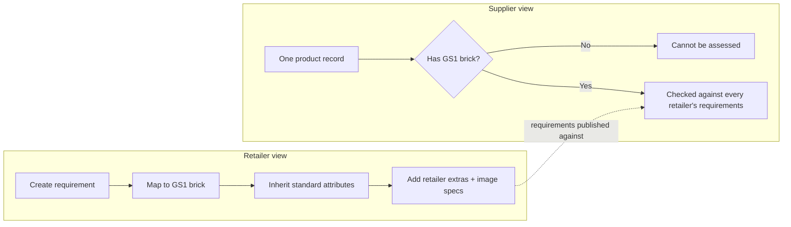
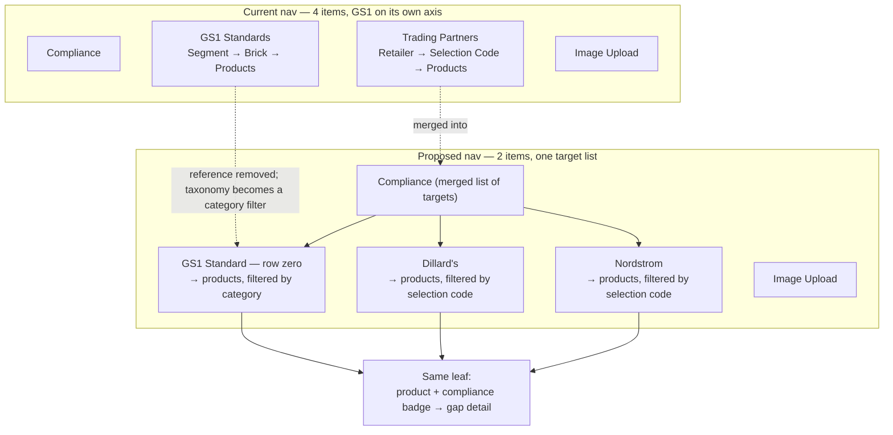
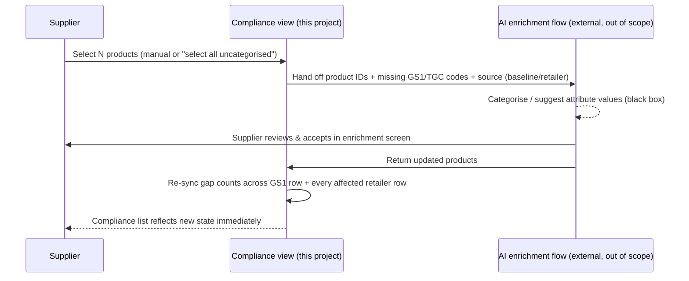

# Supplier View: Categorization, GS1-as-Compliance, and the Enrichment Handoff

A set of recommendations for making it easier for suppliers to get their catalogue GS1-compliant and retailer-ready, building on the existing prototype in this repo.

## 1. What the prototype is doing, end to end

Both sides of this app revolve around one idea: **the GS1 brick code is the pivot that lets many retailers assess one product.**

- **Retailer view** (`screen1-attribute-profiles.tsx`, `screen2-profile-detail.tsx`, `screen3-vendor-exceptions.tsx`): a retailer creates a requirement, maps it to a GS1 brick, and inherits that brick's standard attributes automatically. They can add their own core/custom attributes on top, attach image specs, and carve out per-vendor exceptions (waivers, deadlines, reduced scope).
- **Supplier view** (`screen-supplier-trading-partners.tsx` → `screen-supplier-selection-codes.tsx` → `screen-supplier-products.tsx` → `screen-supplier-gap-detail.tsx`): a supplier drills from a retailer, into that retailer's selection codes, into the products under a code, into a specific product's missing attributes and images — all keyed to the same canonical GS1/TGC codes the retailer used.

The payoff, already stated in the product's own captions: **"You keep one product. Filling a gap once satisfies every retailer who requires it."** That promise only holds if the product has a GS1 brick in the first place — everything downstream depends on it.

## 2. Two systems, one product

This project owns the **compliance view** — diagnosing who requires what, and what's missing, per product and per partner. There is already a **separate AI enrichment screen (out of scope of this project)** that does the actual categorisation and attribute-filling work against GS1 baseline standards.

That's the right split of responsibility. The job of this document is to make the seam between the two invisible to the supplier: the compliance view should diagnose and then **hand off with context**, not ask the supplier to go find the right screen and re-figure-out what needed fixing.

## 3. The supplier journey has a missing first mile

Compliance assessment presupposes a category. Today:

- `screen-supplier-products.tsx` shows an uncategorised product with an **"Assign category" button that does nothing** (no `onClick` handler wired).
- The urgent red banner correctly says *"Compliance cannot be checked until a category is assigned"* — but gives no path to actually assign one.
- A standalone **"GS1 Standards" item in the left nav** (as in the newer working copy) makes this worse. That screen is a **read-only reference dictionary** — segments → brick counts → attributes, straight from the GPC standard. It tells a supplier *what GS1 defines*, but never *how their own products measure up*. A user who clicks it before categorising anything can't act on anything there, and it splits the mental model: GS1 stops looking like "one more thing I comply with" and starts looking like a separate reference system parked next to the compliance work.

Categorisation is the gateway task. Nothing else in the flow works until it's done, so the UI should treat it as such.

## 4. Recommendation 1 — GS1 Standard as "row zero" in one merged Compliance list

The fix has two moving parts: **stop treating GS1 as a place to browse, and start treating it as something to comply with.**

### Reference vs. compliance — remove the reference screen

The current "GS1 Standards" screen conflates two different jobs, and only does the passive one. A *reference dictionary* ("what does GS1 define?") is not the same as a *compliance assessment* ("how do my products measure up?"). Suppliers need the second; the screen only offers the first.

So the standalone **GS1 Standards reference screen is removed entirely.** The brick taxonomy behind it (`lib/gs1-standard-library.ts` — `searchBricks`, `getSegments`, per-brick `extendedAttributes`) doesn't disappear; it keeps doing real work in two places where it's actually actionable: the **categorisation picker** (searching for the right brick) and the **GS1 baseline assessment** (defining what "compliant" means). What goes away is the browsable "here's the standard" destination that a supplier couldn't do anything with.

### Two different navigation shapes — and why they still merge

GS1 and the retailers are navigated on different axes today, and this is the crux of "how do you merge them":

| | Top grouping | then | then | leaf |
|---|---|---|---|---|
| **Retailer** | Retailer | Selection Code | Products | product + compliance badge → gap detail |
| **GS1 (today)** | Segment | Brick (category) | Products | product + compliance badge → gap detail |

The important thing: **the leaf is already identical.** The GS1 brick screen ends in a product list with a per-product compliance badge (*3 GS1 gaps*, *GS1 complete*, …) leading to gap detail — the same shape as the retailer products screen (`screen-supplier-products.tsx`). Only the *path* differs: selection code vs. segment/brick.

That path difference is an artifact of how GS1 was modelled — as a *reference taxonomy* you browse by the standard's own tree, rather than as a *compliance target* you assess your products against. Reframe it as a target and the paths converge:

- A **retailer row** drills to *your products, filtered to that retailer's selection codes*.
- The **GS1 row** drills to *your products, filtered/grouped by category* — because GS1 baseline requirements are defined per category, so category is GS1's natural filter, exactly as selection code is a retailer's.

So merging does **not** flatten GS1 into a look-alike retailer row. It means: **one list of compliance targets, each drilling to the same product-and-compliance leaf via the filter that fits it.** The segment→brick tree survives as a *category filter/grouping inside the GS1 target's product view* — you still get "handbags 80% baseline-compliant, dresses 40%" — it just stops being a separate top-level nav branch.

### Merge Compliance + Trading Partners, add GS1 as row zero

With that reconciliation in place: the working copy's separate *Compliance* and *Trading Partners* items (both already partner-axis) collapse into a single **Compliance** list, and **GS1 joins as row zero** — the one partner every supplier has by default, even before they're connected to any retailer.

- Same mechanics as any other row: product count, gap count, complete count, click through to gap detail.
- Requirements for row zero are simply **the assigned brick's standard `extendedAttributes`** — no new data model needed.
- A **"Baseline / Standard" badge** instead of a retailer logo, so it reads as the foundation everything else builds on. Retailer rows then show *"GS1 baseline + 3 extras"* to make the relationship explicit, and carry the old Trading-Partners metadata (account GLN, active-since) as columns on the same row.
- Uncategorised products show up **inside row zero** as "cannot be assessed — assign a category," the natural on-ramp into Recommendation 2. This also gives brand-new suppliers (zero retailer connections yet) something meaningful to do on day one: get GS1-compliant before a retailer relationship even exists.

### The concrete new state

**Left nav:**

| | Before | After |
|---|---|---|
| Items | Compliance · GS1 Standards · Trading Partners · Image Upload | **Compliance** · Image Upload |

- **Compliance list screen** — row zero "GS1 Standard — Baseline" (Baseline badge, product/gap/complete counts) sits above the retailer rows; each retailer row shows its relationship metadata plus a "baseline + N extras" compliance summary.
- **GS1 row drill-down** (this replaces the old GS1 Standards destination) — the supplier's *own products* assessed against GS1 baseline, presented as a product list with a per-product compliance badge (the leaf your Handbags/Purses screenshot already shows), **filterable/groupable by category** in place of the old segment→brick browse. Categorised products show their baseline gap status; uncategorised products are flagged "Assign category" → hands off to enrichment (Rec 2). No reference dictionary — just your products vs. the baseline.
- **Retailer row drill-down** — the existing selection-codes → products → gap-detail flow, reframed as "GS1 baseline + this retailer's extras."
- **Categorisation picker** — where the GS1 taxonomy now lives: a searchable brick picker (via `searchBricks`/`getSegments`), reached when assigning a category, not a standalone nav screen.

## 5. Recommendation 2 — Categorisation and attribute fill hand off to the existing AI flow, not rebuilt here

The catalogue/products screen (`screen-supplier-products.tsx`) is where this project's responsibility ends and the enrichment flow's begins.

- Add a **selection mechanism** to the product table — checkboxes per row, plus shortcuts like "select all uncategorised" and "select all with GS1 baseline gaps." This supports the range the user described: a couple of products picked manually, or hundreds selected in bulk for AI.
- A single action — **"Assign category" / "Enrich with AI"** — sends the selected product IDs to the external enrichment flow. For gap-filling specifically, it also passes the missing GS1/TGC attribute codes and which requirement (GS1 baseline vs. a named retailer) surfaced them, so the enrichment flow can pre-scope its work instead of the supplier re-finding it.
- On return, the compliance view **re-syncs live**: newly categorised products get their brick and appear across every relevant row; filled attributes clear the matching gap in the GS1 row *and* every retailer row that required it; progress counters update immediately.

> **Scope note:** The enrichment screen's own interaction design (review grid, confidence bands, accept/edit flow, etc.) is intentionally treated as a black box in this document — it's a separate project. Exactly what the redirected screen looks like, and the precise shape of the handoff payload, is a follow-up conversation once both sides are ready to design the integration together.

**Current limitation to flag honestly:** the existing enrichment flow fills **GS1 baseline attributes only**. It has no path today for retailer-specific extras (e.g., a custom core attribute Dillard's requires beyond the brick standard). The natural next step for that external flow is to accept an **arbitrary GS1/TGC-coded requirement set**, not just the baseline — at that point, retailer-extra gaps in this compliance view could deep-link the same way baseline gaps do. Until then, retailer-extra gaps should keep today's manual fill / CSV path, clearly labeled as such so suppliers aren't left waiting on an AI fix that doesn't exist yet.

## 6. Recommendation 3 — Keep the GS1-baseline-first framing even without new enrichment UX

Independent of what the enrichment screen can automate today, the compliance view itself should always present requirements in two tiers:

- **GS1 baseline** (required everywhere) — first, and visually primary.
- **+N retailer extras** (Dillard's, Nordstrom, …) — clearly secondary, additive.

Filling GS1 baseline gaps (via the AI hand-off) visibly moves every retailer row forward at once — this is the concrete payoff of "comply once, benefit everywhere," and it's what nudges suppliers toward baseline-first enrichment even while retailer extras still require manual work.

Retailer guidance notes, already authored in the retailer view (`EditAttributeDialog` in `screen2-profile-detail.tsx`), should stay visible in gap detail regardless of which fix path applies — manual or AI-assisted. They're written once by the retailer specifically to help the supplier get it right; today they're captured but not surfaced anywhere in the supplier's gap view.

## 7. Recommendation 4 — Supporting changes

- **Progress-oriented language** — "87% ready for Nordstrom" reads as forward motion; "8 gaps" reads as a penalty. Same numbers, different framing, same screens.
- **Keep the CSV path** (`screen-supplier-selection-codes.tsx`) as the offline bulk alternative — it remains the only path for retailer-extra attributes until the enrichment flow is extended, so it shouldn't be deprecated.
- **Fix the dead-end CTAs in gap detail** (`screen-supplier-gap-detail.tsx`): the disabled "Upload Image" button and inert attribute rows should become real actions — "Fix with AI" for GS1-baseline gaps (routes into the hand-off), "Fill manually" for retailer extras.
- **Reflect vendor exceptions in supplier-facing gap counts.** Exceptions already exist on the retailer side (`screen3-vendor-exceptions.tsx` — waivers, extended deadlines, reduced scope) but nothing in the supplier view shows their effect. A waived attribute should not count as a gap for that supplier.

## 8. Suggested phasing (non-binding)

This document is a recommendation, not a build plan — but if it becomes one, a reasonable order is:

1. GS1 as row zero in the compliance list (Recommendation 1) — no dependency on the enrichment flow, ships independently.
2. Bulk selection UI + hand-off wiring on the products screen (Recommendation 2) — depends on agreeing the handoff contract with the enrichment flow's owners.
3. Extend the external enrichment flow to accept retailer-extra requirement sets, closing the gap flagged in Recommendation 2.
